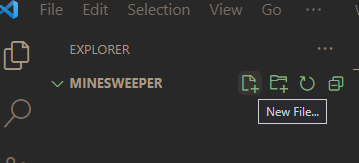

# はじめましょう

### プロジェクトの作成

ツールバーの、 `File` -> `Open Folder` を押し、適当な場所でエクスプローラーを右クリック、新規作成からフォルダを選択し、適当な名前をつけます。ここでは `minesweeper` と名付けます。\
「フォルダを選択」ボタンを押します。\
「Do you trust the..」の場合「Yes, I trust the authors」を選択します。(あなたがauthorになります!)

さあ、ここにコードなんかを追加して、プロジェクトを始めましょう。

### Pythonファイルの作成

Pythonプログラムを記述するファイルを作りましょう。

VSCodeのエクスプローラー内にカーソルを移動すると、 `New File...` というアイコンが現れます。\
クリックして、適当な名前をつけます。\
ここでは `main.py` とします。(拡張子: `.xx` は `.py` にするべきです。)\
拡張機能インストールを勧められますが、入れると便利になります。無くても構いません。

```python
print("Hello World!")
```

恒例を記述してみましょう。\
Python拡張をインストールした場合、ツールバーの `Run` -> `Run without Debugging` から実行することが出来ます。\
していない場合、ツールバーの `Terminal` -> `New Terminal` からターミナルを起動し、

```bash
python main.py
```

で実行できます。

やりました!\
あとは開発するだけで完成です!
